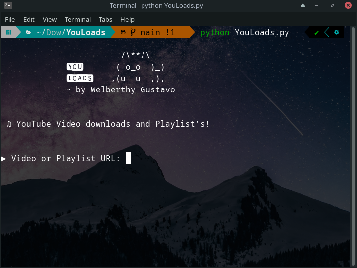

# YouTube Video and Playlist Downloader

Download YouTube videos and playlists with this Python script using the Pytube library. This tool allows you to easily save videos and entire playlists to your computer.



## Introduction

The YouTube Video and Playlist Downloader is a Python program that enables you to download videos and playlists from YouTube. It provides a user-friendly command-line interface for downloading content with ease.

## Features

- Download YouTube videos.
- Download complete playlists.
- Organize downloaded content into separate directories.
- User-friendly command-line interface.

## Usage

1. Clone the repository:

   ```bash
   git clone https://github.com/WelberthyGustavo/YouLoads

## Author

- Welberthy Gustavo
  
## License

- This project is open-source and available under the MIT License. Feel free to use and modify it as needed.

Enjoy downloading YouTube videos and playlists with ease!
